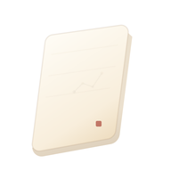

# 素笺写作

Status: active
Last verified: 2026-06-11
Truth source: product decision / code
Supersedes: None



本仓库包含“素笺写作”的源代码，目前已过渡到“Rust 核心 + 各平台轻量客户端”的单仓库架构。

## 架构

- `core/writer_core`: 使用 Rust 编写的**唯一**业务底层核心库。处理所有文件 I/O、项目管理、同步、格式化和设置规则。严格排除 UI 逻辑。
- `apps/android`: 原生 Kotlin Android 客户端。作为当前的主客户端。主业务入口为 `AppServiceBridge + UniFFI`，`BridgeProvider` 只暴露领域 Bridge 给 Repository/ViewModel/UI 做平台适配；旧 `NativeCoreBridge` 类已不再作为 Android 应用源码入口，`bindings/android` 中残留的 JNI 符号名只是历史 ABI 兼容细节，不是 UI 契约。
- `apps/desktop`: 原生 Rust + Qt6/QML Linux 客户端。UI 通过 QObject 后端适配层调用 Rust Core，不允许在 QML 中实现工作区、保存或同步规则。
- `bindings`: 用于连接 Rust 核心和原生客户端的代码。

> 注：原有的 Flutter 客户端由于其架构冲突已彻底移除。

详情请参阅 [《技术路线与架构约束》](docs/TECHNICAL_ROUTE.md)。

## 核心原则

- **唯一业务底层**：Rust 核心 (`core/writer_core`) 是文件和数据逻辑的唯一入口。客户端不允许自行拼接路径、处理 Workspace 规则。
- **单一事实来源**：`docs/workspace_format.md` 定义了工作区格式。它由 Rust Core 维护和操作。
- **客户端做薄**：客户端仅负责 UI 渲染、导航、输入法交互和主题。不应包含任何持久化和数据逻辑。

## 开发

### 工具

- `tools/build_core.sh`: 构建 Rust 核心库。
- `scripts/generate_icons.py`: 从 `assets/brand/icon/source` 生成各平台应用图标资源。

### Rust 核心

```bash
cd core/writer_core
cargo fmt
cargo check
cargo test
```

### Android 客户端

```bash
./tools/build_android.sh
```

**支持目标说明**：官方只支持 `arm64-v8a` 构建。不支持 `x86_64` Android 设备或模拟器。如需支持 `x86_64`，开源用户可自行修改 `tools/build_android.sh` 和 `apps/android/app/build.gradle.kts` 添加对应 ABI。

### Linux 客户端

Linux 客户端统一使用 Qt6。CI、`apps/desktop/build.rs` 和目录 README 都以 Qt6 为唯一构建链路；不要混入 Qt5 QML/plugin 路径。

```bash
cargo run -p sujian-desktop
```

If you encounter rendering issues (such as double UI or black screen misalignment under Wayland), try running with basic render loop and enabling debug logs:

```bash
QSG_INFO=1 QSG_RENDER_LOOP=basic cargo run -p sujian-desktop
```

### 实机测试验证步骤

- 新建作品。
- 进入作品，确认自动出现“第一卷”。
- 点击新建章节，并输入内容。
- 确认自动保存。
- 退出后重新进入该章节，确认内容仍在。

## 文档

- `docs/TECHNICAL_ROUTE.md`: 全局技术路线与架构约束
- `docs/CROSS_PLATFORM_CAPABILITY_CONTRACT.md`: 跨平台能力契约与 Core-first 架构约束
- `docs/API_CONTRACTS.md`: 接口边界与交互契约 (Bridge, Backend, QML)
- `docs/PRODUCT_DESIGN.md`: 素笺产品设计与视觉契约 (产品定位, 莫奈取色, 星图, 设置设计)
- `docs/workspace_format.md`: 磁盘上文档结构的单一事实来源
- `docs/settings_schema.md`: 本地和可同步设置定义
- `docs/sync_rules.md`: 同步规则
- `docs/starmap_semantics.md`: 星图语义地基 (独立对象与引用安全)
- `docs/editor_engine_route.md`: 自绘编辑器与统一事件层路线
- `docs/desktop_ime_notes.md`: Desktop (Linux) 输入法笔记
